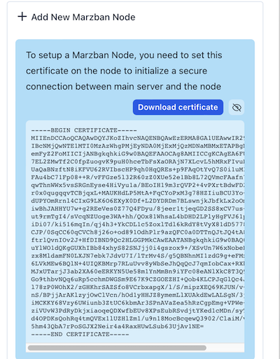
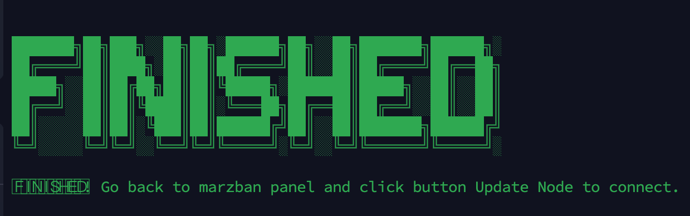
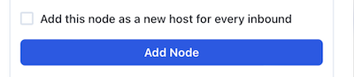

# welcome
<div dir="rtl">
<h2>
راه اندازی مرزبان نود در سرور در راحتترین روش
</h2>
* این اسکریپت دقیقا مطابق با راه اندازی نود در مرزبان که داکیومنت آن در لینک زیر می باشد استفاده میکند

   ```sh
     https://gozargah.github.io/marzban/fa/docs/marzban-node
  ```

[@آموزش مرزبان نود در گیت هاب خود مرزبان](https://gozargah.github.io/marzban/fa/docs/marzban-node)
<hr>


* سیستم عامل پیشنهادی : ubuntu 22

<hr>
 * حتما سرور خود را از قبل آپدیت و اپگرید و در انتها آنرا ریبوت نمایید


   ```sh
      apt update && apt upgrade -y
      sudo reboot
   ```


 * بعد از اجرای دستور بالا و ریبوت سرور اقدام به اجرای اسکریپت تمایید تا به درستی اجرا شود


روش اجرا :
>1 -  اسکریپت شامل 6 مرحله می باشد که مراحل 1 تا 4 آن بصورت خودکار تنظیمات را انجام میدهد.

>2 -  در مرحله 5 شما باید کد سرتیفیکت مربوط به نود را از پنل مرزبان خود کپی کرده و در این مرحله paste نمایید. عکس 
> زیر نمونه می باشد
> 

>3 -  نکته: بعد از جایگذاری سرتیفیکت برای ادامه کار حتما از ترکیب کلید های CTRL + D استفاده نمایید


>4 -  نکته اخر: بعد از اتمام مرحله 6 و پیغام FINISH
> 
به پنل مررزبان خود برگشته و کلید آپدیت نود را بزنید تا به نود متصل گردد. اگر خطایی دریافت کردید چندبار دکمه آپدیت 
را بزنید چون ممکن است این اتصال کمی با تاخیر شناسایی شود.
> 


 کد اجرای دستور در کامند لینوکس :

   ```sh
      bash <(curl -fsSL https://raw.githubusercontent.com/nsa14/script-marzban-node/master/install.sh)
   ```
 
<br>


</div>